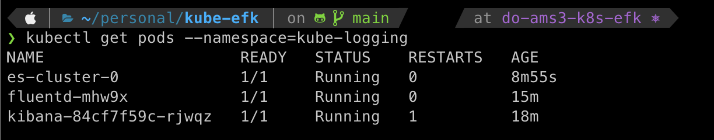

# kube-efk
Deploying EFK stack on Kubernetes

This will deploy Elastic Search, Fluentd, and Kibana on a Kubernetes cluster.

Elastic Search (ES) is used to store the logs data and search it.
Kibana provides a dashboard to effectively search data on ES and make dashboards.
Fluentd is used instead of Logstash (in traditional ELK stack) for collecting, transforming, and shipping data to ES.

Elastic Search will be run as a StatefulSet and have a persistent volume attached. Currently, we'll have 3 pods running for ES. We'll also have a service to connect with Kibana.

Fluentd will be run as a daemon-set so that it is available on all worker nodes to collect log data from the containers and provide it to ES.

Kibana will be run as a deployment of 1 pod and service to interact with Elastic search for displaying data.

## Steps

We'll have all the pods/deployment/replica-set in `kube-logging` namespace.

```bash
kubectl create -f kube-logging.yaml
```

Creating ES service:

```bash
kubectl create -f elasticsearch_svc.yaml
```

Creating ES StatefulSet and connecting it to SVC:

```bash
kubectl create -f elasticsearch_statefulset.yaml
```

**Optional**: We can monitor StatefulSet as it is rolled out with 3 pods:

```bash
kubectl rollout status sts/es-cluster --namespace=kube-logging
```

From one terminal, we can forward port 9200 for ES-cluster-0 to the local machine using:

```bash
kubectl port-forward es-cluster-0 9200:9200 --namespace=kube-logging
```

**Optional**: We can test the connection with ES using the curl command:

```bash
curl http://localhost:9200/_cluster/state?pretty
```

A response similar to this might be seen on successful connection:

```bash
{
  "name": "es-cluster-0",
  "cluster_name": "k8s-logs",
  "cluster_uuid": "PS3a_GbPQQ6LltHpUeQYSQ",
  "version": {
    "number": "7.2.0",
    "build_flavor": "default",
    "build_type": "docker",
    "build_hash": "508c38a",
    "build_date": "2019-06-20T15:54:18.811730Z",
    "build_snapshot": false,
    "lucene_version": "8.0.0",
    "minimum_wire_compatibility_version": "6.8.0",
    "minimum_index_compatibility_version": "6.0.0-beta1"
  },
  "tagline": "You Know, for Search"
}
```


Now, we'll have the Kibana deployment and service deployed:

```bash
kubectl create -f kibana.yaml
```

**Optional**: The rollout status can be viewed via:

```bash
kubectl rollout status deployment/kibana --namespace=kube-logging
```

In a second terminal we can port forward 5601 of Kibana to local using:

```bash
kubectl port-forward <replace-this-with-kibana-pod> 5601:5601 --namespace=kube-logging
```

Finally, we'll spawn Fluentd as a Daemon-Set so that it is available on all the worker nodes using:

```bash
kubectl create -f fluentd.yaml
```

We can verify that DaemonSet rolled out successfully using:

```bash
kubectl get ds --namespace=kube-logging
```

We can now verify all the pods in the namespace kube-logging. It should have 3 pods of elastic search, and one each for fluentd and kibana, given that we're on a single node.

```bash
kubectl get pods --namespace=kube-logging
```


Now we can access the Kibana dashboard on [http://localhost:5601](http://localhost:5601)


We can create an index pattern:


and then can see the analytics:


That's it. Now we can detect all the logs using fluentd and search ES through Kibana.

For deploying on Digital Ocean, the Stateful Set for Elastic Search was reduced to 1 pod. The final pods looks like this:



and we can see everything deployed on Digital Ocean interface


-----------------

This is a sample project I did to learn `doctl` for managing resources on Digital Ocean and Kubernetes basics.

I port-forwarded from DO kubernetes cluster to demo it locally.
